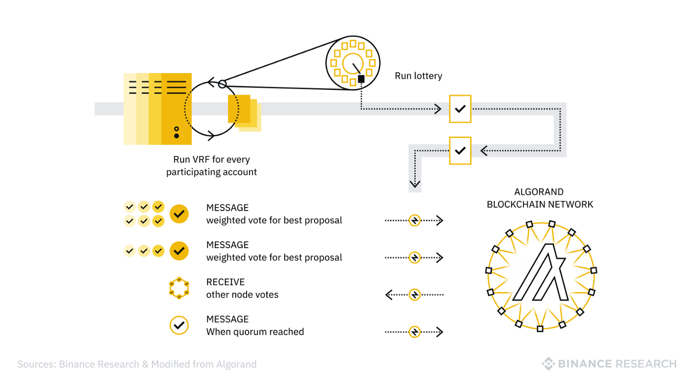

# A decentralized application using the Algorand blockchain network
An end-to-end Web3 dApp: certificate generation, distribution, and value and transaction transfer with Algorand NFTs and smart contracts.


## The Algorand blockchain network 


**Table of contents**

- [Overview](#overview)
- [Objective](#objective)
- [Requirement](#major requirement)
- [Install](#install)
- [How to use the dApp](#examples)
- [The decentralized application](#dApp)
- [Notebooks](#notebooks)
- [Scripts](#scripts)
- [Test](#test)
- [Author](#author)


## Overview
> Web3 is the third generation of the web, or the commonly known and referred to communication network that we all love and call the internet. But Web3 is much more than the commonly known communication network and its uses. Web3 technology is inherently about the user controlled internet. It is being achieved by a growing stack of decentralized technologies, such as blockchains, smart contracts, oracles, crypto wallets, storage networks, and more.   


## Objective
> In this project the main objective is to build an end-to-end Web3 decentralized application on the Algorand Blockchain that will help its client generate and distribute Non-Fungible Tokens (NFTs) as certificates that will represent the successful completion of a task or project to its customers, and allow its customers that are holding these NFTs to interact with a smart contract to perform pre-defined actions.  


## Major requirements
> Python 3.5 or above
> 
> Pip
> 
> py-algorand-skd
> 
> Flask 
> 
> React


## Install

### Installing the Algorand Sandbox environment (Optional - for development use only)
```
git clone https://github.com/algorand/sandbox.git
cd sandbox
./sandbox up
```
- Detailed guidelines and instructions to develop with the Algorand sandbox could be found [here](https://github.com/algorand/sandbox)


### Installing the decentralized application
```
git clone https://github.com/Fisseha-Estifanos/algorand_dApp.git
cd algorand_dApp
pip install -r requirements.txt
```


## Examples
>
>
>


## The decentralized application
> The decentralized application could be found here in the algorand_dApp folder.


## Notebooks
> All the notebook used for demonstration can be found here in the form of an .ipynb file, in the notebooks folder.


## Scripts
> All the scripts and modules for the creation of NFT certificates, transaction handling, smart contracts and any other helper scripts and modules along with default parameters and values used will be found here, in the scripts folder.


## Tests
> All the unit and integration tests are found here in the tests folder.


## Author
> 👤 **Fisseha Estifanos**
>
> - GitHub: [Fisseha Estifanos](https://github.com/fisseha-estifanos)
> - LinkedIn: [Fisseha Estifanos](https://www.linkedin.com/in/fisseha-estifanos-109ba6199/)
> - Twitter: [Fisseha Estifanos](https://twitter.com/f0x__tr0t)


## Show us your support
> Give us a ⭐ if you like this project, and also feel free to contact us at any moment.
