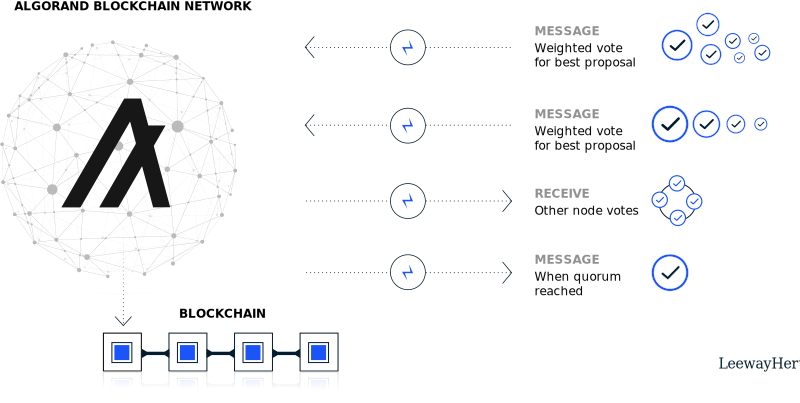

# A decentralized application using the Algorand blockchain network
An end-to-end Web3 dApp: certificate generation, distribution, and value and transaction transfer with Algorand NFTs and smart contracts


## The Algorand blockchain network 


**Table of contents**

- [Overview](#overview)
- [Objective](#objective)
- [Requirement](#requirement)
- [Install](#install)
- [How to use the dApp](#examples)
- [Notebooks](#notebooks)
- [Scripts](#scripts)
- [Test](#test)
- [Author](#author)


## Overview
> In the current state of our world, data plays a very huge role in almost everything we do. Data is everywhere, large volumes of data, forming many different types, are generated from many different sources and from a wide array of locations, very rapidly. Not making sense of this valuable resource (if not the most valuable resource) would not only be foolish but also very expensive.


## Objective
> The main objective of this startup is to help the organization obtain critical intelligence based on public and private data they collect and organize. 
>
> This is going to be achieved by deploying an end to end ELT data pipeline that will extract the required data from several sources of data generation tools listed above, then loading it into a data warehouse in order to later transform the obtained data that can serve the needs of several people in the organization's staff like data scientists, machine learning engineers, business and data analysts as well as several reporting staff members


## Major requirements
> Python 3.5 or above
> 
> Pip
> 
> Airflow
> 
> DBT 
> 
> PostgreSQL
> 
> Redash


## Install

```
git clone https://github.com/Fisseha-Estifanos/ELT.git
cd ELT
pip install -r requirements.txt
```


## Examples
>
>
>


## Notebooks
> The EDA notebook demonstration can be found here in the form of an .ipynb file, in the notebooks folder.


## Scripts
> All the modules for the EDA notebooks, analyses, helpers and any other scripts will be found here.


## Tests
> All the unit and integration tests are found here in the tests folder.


## Author
> 👤 **Fisseha Estifanos**
>
> - GitHub: [Fisseha Estifanos](https://github.com/fisseha-estifanos)
> - LinkedIn: [Fisseha Estifanos](https://www.linkedin.com/in/fisseha-estifanos-109ba6199/)
> - Twitter: [Fisseha Estifanos](https://twitter.com/f0x__tr0t)


## Show us your support
> Give us a ⭐ if you like this project, and also feel free to contact us at any moment.
